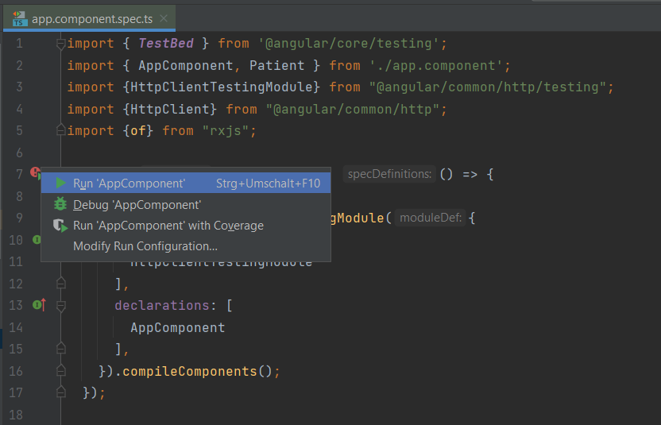

# Angular Request Assignment

In dem Projekt befindet sich der Stand der vorherigen Unterrichtseinheit. Es wird also die eigene IP-Adresse von `ifconfig.me` abgefragt. Der Code kann gelöscht werden.

<b>Folgendes ist zu implementieren:</b>

Erzeuge mittels `http.get(...)` einen Request auf deine REST-API aus dem 4. Jahrgang. Die URL für *alle* Patienten sollte ungefähr so aussehen: `http://localhost:8080/api/patient`. 

Speichere die zurückgelieferten JSON-Rohdaten in einem eigens angelegten Typ. Dieser könnte ungefähr so aussehen:

```ts
// https://hl7.org/fhir/patient.html 
interface Patient{
    name: string;
    gender: string;
    birthDate: Date;
    ...
}
```

Wenn dann von `/api/patient` mehrere Patienten zurückgemeldet werden sollen diese in einem Patienten-Array (`Patient[]`) gespeichert werden.

Zeige eine Tabelle mit allen Patienteninfos in einer Übersicht an. Diese könnte so aussehen:

<table>
    <tr>
        <td>Name</td>
        <td>Geschlecht</td>
        <td>Geburtsdatum</td>
        <td>...</td>
    </tr>
        <tr>
        <td>Max</td>
        <td>Mustermann</td>
        <td>1.1.2000</td>
        <td>...</td>
    </tr>
    <tr>
        <td>...</td>
    </tr>
</table>

## Abgabe

Abzugeben sind neben dem Quellcode auch Screenshots in denen ersichtlich ist 
 - alle Patienten in einer Tabelle angezeigt werden
 - dass das Spring-Backend im Hintergrund läuft
 - dass Angular einen Request an Spring gesendet hat
    - möglich über den Netzwerkanalyse-Tab in Firefox


In dem Ordner `screenshots` sollen diese gespeichert werden. Über die GIthub-Actions wird automatisch ein Test ausgeführt welcher prüft ob die HTTP-Anfrage korrekt durchgeführt wurde.
Um zu sehen ob der Test lokal funktioniert kannst du mit ``npm run test`` dies lokal prüfen. Auch kannst du mit Webstorm die Tests in der Datei `app.component.spec.ts` direkt ausführen.




## Anleitungen:
 - Neues Angular Projekt anlegen: https://angular.io/tutorial/toh-pt0
 - HTTPClient in Angular: https://angular.io/guide/http


## Bewertungsgrundlagen
Fülle in deiner eigenen README.md folgende Punkte aus. Wenn du nur Teilpunkte dazugibst begründe warum du nicht die volle Punktzahl erreicht hast. Schreibe dann am Ende des Dokuments die von dir erreichte Gesamtpunktzahl hin. Wenn mir eine Bewertung ungewöhnlich vorkommt und es zwischen meiner Bewertung und deiner eigenen einen Unterschied von mehr als 20% gibt werte ich das als Schummeln und du bekommst keine Punkte. 

1. Funktionierende HTTP-Anfrage
   - Senden einer HTTP-Anfrage an `/api/patient`
   - Empfangen einer Liste von JSON-Daten und des Statuscodes 200
   - Wertungskriterium: xx/20%
2. Korrekte Datentypen
   - Speichern der Patientendaten in einem eigenen Typ gemäß der HL7 FHIR-Spezifikation mittels `interface Patient`
   - Jedes Feld des vom Server gesendeten JSON soll mit dem korrekten Datentypen repräsentiert werden. 
   - Wertungskriterium: xx/20%
3. Anzeige aller Patientendaten
   - Darstellung aller Patientendaten in einer Tabelle erstellt mit dem `<table>`-Tag oder gleichwertigen Konstruktionen aus Angular Material.
   - Korrekte und vollständige Darstellung aller Daten, einschließlich Name, Geschlecht und Geburtsdatum
   - Wertungskriterium: xx/20%

4. Code-Qualität
   - Gut strukturierter, lesbarer und wartbarer Code, der den bewährten Praktiken der Angular-Entwicklung entspricht:
   - Trennung von Anzeige- und Geschäftslogik
   - Wertungskriterium: xx/20%

5. Screenshots zum Nachweis erstellt und hochgeladen in den `/screenshots`-Ordner
    - Wertungskriterium: xx/20%

6. Dokumentation (optional)
   - Ausreichende Dokumentation des Codes zur Unterstützung anderer Entwickler bei der Erweiterung der Anwendung
   - Kurzes README-Dokument mit grundlegenden Schritten zur Installation und Ausführung der Anwendung
   - Wertungskriterium: +xx/+10% (optional)
