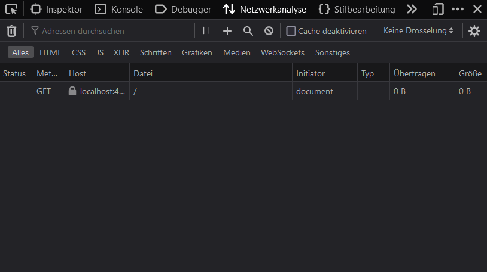

# Angular Request Assignment

In dem Project befindet sich der Stand der vorherigen Unterrichtseinheit. Es wird also die eigene IP-Adresse von `ifconfig.me` abgefragt.

<b>Folgendes ist zu implementieren:</b>

Erzeuge mittels `http.get(...)` einen Request auf deine REST-API aus dem 4. Jahrgang. Die URL für *alle* Patienten sollte ungefähr so aussehen: `http://localhost:8080/api/patient`. 

Speichere die zurpckgeleiferten JSON-Rohdaten in einem eigens angelegten Typ. Dieser könnte ungefähr so aussehen:

```ts
// https://hl7.org/fhir/patient.html 
interface Patient{
    name: string;
    gender: string;
    birthDate: Date;
    ...
}
```

Wenn dann von `/api/patient` mehrere Patienten zurückgemeldet werden sollen diese in einem Patienten-Array (`Patient[]`) gespeichert werden.

Zeige eine Tabelle mit allen Patienteninfos in einer Übersicht an. Diese könnte so aussehen:

<table>
    <tr>
        <td>Name</td>
        <td>Geschlecht</td>
        <td>Geburtsdatum</td>
        <td>...</td>
    </tr>
        <tr>
        <td>Max</td>
        <td>Mustermann</td>
        <td>1.1.2000</td>
        <td>...</td>
    </tr>
    <tr>
        <td>...</td>
    </tr>
</table>


Abzugeben sind neben dem Quellcode auch Screenshots in denen ersichtlich ist 
 - dass Patienten alle Patienten in einer Tabelle angezeigt werden
 - dass das Spring-Backend im Hintergrund läuft
 - dass Angular einen Request an Spring gesendet hat
    - möglich über den Netzwerkanalyse-Tab in Firefox




## Anleitungen:
 - Neues Angular Projekt anlegen: https://angular.io/tutorial/toh-pt0
 - HTTPClient in Angular: https://angular.io/guide/http
